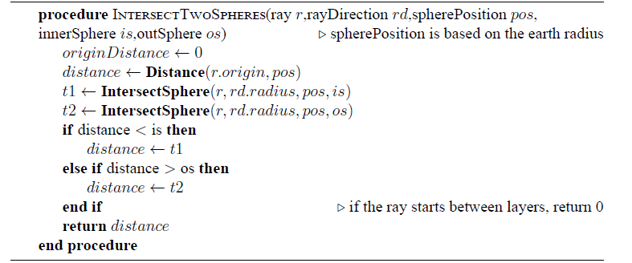

# Project-Volumetric Cloud System
Vulkan-based implementation of volumetric clouds base from the paper "Efficient Real-time Volumetric Cloud Rendering using a Hybrid Sparse Voxel-Noise Cloud Model"


**You can find the paper in the path ./SkyEngine/paper.pdf**


## 📝 Table of Contents


- [Project-Volumetric Cloud System](#project-volumetric-cloud-system)
  - [📝 Table of Contents](#-table-of-contents)
- [Overview](#overview)
- [Main Features](#main-features)
- [Installation ](#installation-)
  - [FSK Issues](#fsk-issues)
- [Theory ](#theory-)
  - [1. Cloud Modelling](#1-cloud-modelling)
    - [1. Noise cloud modeling](#1-noise-cloud-modeling)
      - [Cirro Cloud layer](#cirro-cloud-layer)
  - [2. Voxel Cloud Modeling](#2-voxel-cloud-modeling)
    - [Cloud Flow](#cloud-flow)
  - [2. Cloud Raymarching Process](#2-cloud-raymarching-process)
    - [Three-Phases Raymarching Algorithm](#three-phases-raymarching-algorithm)
    - [RayMarching Optimization](#raymarching-optimization)
    - [SDF Raymarching](#sdf-raymarching)
  - [3. Cloud Lighting](#3-cloud-lighting)
    - [Direct Light](#direct-light)
    - [Ambient Scattering](#ambient-scattering)
    - [Secondary Light Radiance](#secondary-light-radiance)
  - [4. Ray Reprojection and Motion Blur](#4-ray-reprojection-and-motion-blur)
  - [5. Day and Night Sky](#5-day-and-night-sky)
  - [6. SDF terrian-cast Shadowing](#6-sdf-terrian-cast-shadowing)
  - [7. Post Process Pipeline](#7-post-process-pipeline)
- [Performance](#performance)
- [Roadmap  ](#roadmap--)
  - [Milestone 1](#milestone-1)
  - [Milestone 2](#milestone-2)
  - [Milestone 3](#milestone-3)
  - [Milestone 4](#milestone-4)
  - [Milestone 5: Advance Features](#milestone-5-advance-features)
    - [Modeling](#modeling)
    - [Lighting](#lighting)
    - [Rendering](#rendering)
  - [Milestone 6](#milestone-6)
    - [Modeling](#modeling-1)
    - [Lighting](#lighting-1)
    - [Rendering](#rendering-1)
- [Future Considerations ](#future-considerations-)
  - [Cloud Animation](#cloud-animation)
- [Credits:](#credits)
  - [Libraries:](#libraries)


# Overview 

Volumetric cloud technology is experiencing rapid growth in video games and simulation applications. Currently, mainstream cloud modeling methods mainly include noise clouds and voxel clouds. Noise clouds, due to their cost-effective rendering over large areas, have found extensive application. Voxel clouds, on the other hand, are valued for their ability to offer more realistic simulation and higher rendering speeds. The spatial field data stored in voxels also provides the potential for precise physical fluid simulation. 

However, voxel clouds face challenges, particularly in terms of rendering costs and memory overhead, especially in large-scale scenes. Balancing performance costs and realism is thus crucial for the development of
voxel cloud technologies.

To address these challenges, this study introduces a novel rendering method namednMixed Cloud. This approach combines the characteristics of voxel and noise clouds. It leverages the high-precision features of voxel clouds to fill areas of higher visual priority, while employing the more cost-effective noise clouds for other vacant regions. To accurately sample sparse cloud structures, a novel three-stage ray marching algorithm is introduced during the ray tracing stage.

# Main Features

The above image illustrates the cloud characteristics that our hybrid cloud solution aims to achieve. The following items describe the features supported by the renderer:

-  A sparse-structured of procedural noise clouds and realistic voxel clouds.
-  Using three-phase raymarching algorithm with SDF acceleration core.
-  SDF Terrian-Cast shadow
-  Post-processing framework: godrays, radial blur, tone mapping.
-  Layered ambient lighting model.
-  Preetham physical sky model.
-  Procedural day-night sky.
-  ImGui UI framework for debuging.
-  Support for cirrus clouds.
-  Support for tropospheric clouds (high-level cumulus, cumulonimbus).
-  Support for wind disturbances and the impact of precipitation on clouds.


# Installation <a name = "InitProject"></a>
This project is built for 64bit Windows and uses precompiled libs.

Environment：

```
    cpu   12th Gen Intel(R) Core(TM) i7-12700K   3.61 GHz
    gpu   GTX3080ti
    ram   32.0 GB
```

Libs:

```
    Vulkan 1.1.121.0  
    glfw-3.2.1
    glm
    tinyobj
    stb
    imgui
```

[MUST!] Modify the paths of additional files/static libraries in the 'Include' and 'Linker' sections of the project properties to ensure that the runtime library links correctly. 
**It is only for the vulkan libs!!!  Add your vulkan install path to the dictionary!!!**

```
wait to do:  use cmake to link those libs 
```


Bring up the Debug Output window: Add a command in the 'post-build event' section under 'Build Events' in the project properties.

`editbin /SUBSYSTEM:CONSOLE $(OUTDIR)$(ProjectName).exe`

Then open the file listed below and run the project in x64 debug mode.


## FSK Issues
* The target platform is an x64 window application, not the default x86.
* If the Vulkan validation layers are found to be unsupported or missing (22 native layers), you need to reinstall the Vulkan SDK.
* error MSB6006: “cmd.exe”has existed，code 3.    
  solution: check include file path

# Theory <a name = "VolumatricCloudTheory"></a>


## 1. Cloud Modelling 

---
In production, artists usually need two types of volumetric clouds:

- High-altitude cloud layers divided into troposphere and cumulus layers (e.g., stratus, cumulus, stratocumulus, cirrus).
- Voxel clouds with specific shapes and volumes to meet artistic requirements.

For high-altitude clouds, we use the procedural noise-based solution from the paper to create detailed, layered clouds with minimal parameters. For voxel clouds, we model in Houdini, apply alligator noise erosion to convert models to VDB data, and export as 3D textures, which integrate seamlessly with noise-based clouds.

This approach combines artistic flexibility with the randomness and convenience of procedural generation.


- Multiple low-res voxel textures are anchored in a large virtual 3D texture.
- Noise textures are stretch-mapped in the virtual texture without losing precision.

**The high-res virtual texture is a logical composition of smaller textures, not physically stored in memory.**

### 1. Noise cloud modeling

Our procedural modeling process is largely consistent with the description provided in the paper. The key aspect for understanding the modeling section of the paper is the remapping functions they provide.

```
remap(x, mina, maxa, minb, maxb) = (x - mina) / (maxa - mina) * (maxb - minb) + minb
```

The core principle behind this, as illustrated in the graph plotted using [GraphToy](http://www.iquilezles.org/apps/graphtoy/), involves mapping a value from one range to another while maintaining its relative proportion between the minimum and maximum values.


Let's assume that the orange curve represents our low-resolution cloud density:


Now, let's assume that the green curve represents our high-resolution cloud density. When we remap the low-resolution density using the green curve as the minimum value and 1 as the maximum value, we obtain an interesting result:


The blue curve represents the final cloud density, which overlaps with the original here:


Here are some key points to note:

- Unique Shape Formation: Due to the phase difference between the low-resolution and high-resolution density functions, this approach creates a series of unique shapes.
- Preservation of High-Density Regions: This method maintains the integrity of high-density areas, whereas using multiplication or subtraction for blending tends to lead to zero density too quickly.
- Easy to Calcuate: Even with these simple representations, a wide variety of cool variations can be achieved.

Ref：


The above diagram illustrates the Density Height Gradient at a specific point within the cloud hemisphere.

- We use 8 mathematical presets to represent different cloud types, primarily focusing on low-altitude regions.
- To achieve natural transitions, these cloud types are blended at the sample location based on their presence at that point.
- The parameter cloud_Coverary indicates the desired level of cloud coverage at the sample location, ranging from 0 to 1.
- By multiplying the Density Height Gradient by a noise texture, we can generate the basic shape of the clouds.

```
// Get the blended density gradient for 3 different cloud types
// relativeHeight is normalized distance from inner to outer atmosphere shell
// cloudType is read from cloud placement blue channel
float cloudLayerDensity(float relativeHeight, float cloudType) {
    relativeHeight = clamp(relativeHeight, 0, 1);

    float altocumulus = max(0.0, remap(relativeHeight, 0.01, 0.3, 0.0, 1.0) * remap(relativeHeight, 0.6, 0.95, 1.0, 0.0))*cloudrenderer.cloudinfo1.z;
    float cumulus = max(0.0, remap(relativeHeight, 0.0, 0.25, 0.0, 1.0) * remap(relativeHeight,  0.3, 0.65, 1.0, 0.0))*cloudrenderer.cloudinfo1.y; 
    float stratus = max(0.0, remap(relativeHeight, 0, 0.1, 0.0, 1.0) * remap(relativeHeight, 0.2, 0.3, 1.0, 0.0))*cloudrenderer.cloudinfo1.x; 

    float stratocumulus = mix(stratus, cumulus, clamp(cloudType * 2.0, 0.0, 1.0));
    float cumulonimbus = mix(cumulus, altocumulus, clamp((cloudType - 0.5) * 2.0, 0.0, 1.0));
    return mix(stratocumulus, cumulonimbus, cloudType);
    
}
```


For noise-based cloud modeling, we use low-frequency noise to form the base cloud shape. This is a 4-channel, 128x128x128 3D texture where:

The R channel stores Perlin-Worley noise.
The G, B, and A channels store three progressively increasing Worley noise levels.
Original rgba8 4-channel size: ~8 MB. Compressed to DXT5 (3:1) reduces it to ~2.675 MB.

it looks like this


#### Cirro Cloud layer

We compiled a texture with 3 tiled cloud types: thin cirrostratus, turbulent stratocumulus, and transitional clouds. By blending these types based on sampled cloud type, we achieve smooth transitions. For this, a low coverage value drives the power function's exponent, which erodes cloud shapes at low coverage.


The image below shows cloudtype=0, displaying wispy cirrus clouds:


## 2. Voxel Cloud Modeling

Voxel cloud modeling is challenging, so we primarily use Houdini for its robust volume modeling and SDF calculation nodes, enabling efficient modeling and baking of cloud density and SDF information into 3D textures.


The final noise cloud output is a 4-channel 128x128x64 3D texture:

- The R channel contains Perlin-Worley noise.
- The G, B, and A channels store three levels of Worley noise.
- An additional 128x128x64 single-channel r16 3D texture holds frequently accessed SDF data.

Voxel cloud textures use cloud density and two levels of Alligator noise, which, compared to Perlin-Worley noise, better define voxel cloud shapes."


### Cloud Flow
Volume clouds exhibit three flow effects: global flow, local flow, and gradient effects in cumulonimbus clouds. For sky volume clouds, global flow is usually sufficient, while local flow and gradient effects are used in situations like cloud seas and storm clouds.

**Global Flow**
We provide two global wind speeds for controlling the overall movement of volume clouds: one for shaping (affecting the CloudMap and basic shape texture) and another for detail (affecting the high-frequency noise texture). 

Notably, the Y component of both wind speeds controls vertical rolling of the noise. This allows the shape noise texture to roll along the Y-axis, changing the overall cloud distribution over time—one of the advantages of using 3D textures.


```
//all sample points are offset by a time-based wind and add an additional height-based offset
windOffset = cloudrenderer.wind_strength * (sky.wind.xyz   + lsHeight * vec3(0.1, 0.05, 0)) * (timeOffset + lsHeight * 200.0)*(cloudrenderer.cloudinfo1.w);
```
Additionally, we introduce a deviation in wind direction and strength based on cloud height to reflect the increasing wind force with altitude.

By increasing the precipitation rate, we can transform any sky into cumulonimbus clouds with 70% coverage. In the image below, I gradually increase the precipitation value to 100%.


Precipitation control not only adjusts the cloud layers, but by increasing the wind speed and adding particle effects for rain, we can create the effect of storm clouds rolling in and gradually beginning to rain on us.
**Local Flow**

Local flow effects are typically implemented using Flow Maps. Unlike global flow, Flow Maps can record directions in any orientation and vary in speed. As time progresses, the noise texture can become increasingly stretched. To address this issue, we use fract(time) to repeat the noise texture flow over a short distance. Then, we sample the noise texture again using fract(time + 0.5), which flows at half the speed, and interpolate between the two results to achieve a relatively smooth flow effect. For more detailed implementation, refer to this [article](https://catlikecoding.com/unity/tutorials/flow/texture-distortion/).

Calculating CloudDensity for both samples at each point would be computationally expensive, so we only apply the Flow Map to the flow of the shape noise. This means we sample the shape noise texture twice while keeping the other textures unchanged. The effect is illustrated in the image below:


## 2. Cloud Raymarching Process


<!--  -->

The figures upon show the process of the raymarching algorithm

Raymarching is the core algorithm of this project and the most computationally expensive function used.

Below is a basic overview of the algorithm:

- In the compute shader, rays are cast from the camera into the atmosphere, which is a large bounding sphere. Rays are also cast into the atmosphere's outer shell to determine the maximum distance of the rays.
- Starting from the atmosphere, take large steps, only checking if the sample points are within the low-resolution clouds. The process of determining whether a point is in the cloud is described during cloud modeling.
- If a sample point is inside a cloud, step back and switch to a smaller step size.
- At the smaller step size, if the sample point is in the low-resolution cloud, also check if it is inside the high-resolution cloud.
- If the sample point is in the high-resolution cloud, several lighting samples are also needed. This is explained in more detail in the Cloud Lighting Process.
- If some samples at the smaller step size miss, revert to the smaller step size.
- If the sampled cloud is almost/completely opaque, has reached the outer edge of the atmosphere, or has reached the maximum number of steps, terminate early.



- As the camera ascends and reaches the area between cloud layers, it becomes necessary to switch the rendering method. At this point, the starting point of the ray needs to be redefined, shifting it back to the original camera position. Once the camera altitude exceeds the outer atmosphere, the definitions of the starting and ending points should be swapped. This approach enables a seamless transition from a ground-level perspective to an aerial view.

### Three-Phases Raymarching Algorithm
Due to the sparse structure of cloud modeling, the cloud rendering algorithm also requires modifications. I refer to this new rendering approach as the Three-Phases Raymarching Algorithm. 
For more details, please refer to Sec.5 of the paper


### RayMarching Optimization
**1. Early Exit**

we can exit the ray marching loop early when the light attenuation reaches a level, without causing significant visual differences.
```    
       //raymarch early exit
       
        if(accumDensity > 0.99) {
            accumDensity = 1.0;
            break;
        }
      ......

       //sub raymarch early exit
       //When exceeds a threshold (eg, 1.3), switch to a lower-detail model
       if (lsDensity > 0.0&&densityAlongLight<1.3) {                    
           lsDensity = cloudHiRes(lsPos + windOffset_2, stepSize, lsDensity, lsHeight);               
       }
```

**2. Adaptive Raymarching Stepsize**

There may still be large empty areas within the cloud layer, so we initially use a normal step size to progress through the scene. When a cloud is detected, we take a step back and switch to a small step size (0.3 times the normal step size) for more precise sampling.

If a certain number of consecutive steps encounter zero density (indicating no clouds), we revert to the larger step size to speed up the raymarching process.
```
        if (density > 0.0) // hit the cloud
        {
            misses = 0;
            if (noHits) {
                //start high-resolution march
                stepSize = 0.05 * atmosphereThickness;
                t -= stepSize;
                stepSize *= 0.3;
                noHits = false;
                continue; // go back half a step
            }
            ......
        } else if (!noHits) {// when the ray get out the cloud right now, count the miss and turn to SDF spheretracing if enabled
            misses++;
            if (misses >= 6) {//10 maybe it is too big
              noHits = true; // revert to low resolution marching
              stepSize = 0.05 * atmosphereThickness;
             }
          
        }    
```

### SDF Raymarching 
A Signed Distance Field (SDF) is a scalar field in space where each value represents the distance from a given point to the nearest surface (the zero level set). One of the key advantages of SDFs is their ability to speed up the ray marching process using the sphere tracing algorithm:


**However**, as the ray approaches the edges of surfaces, the step size decreases significantly, slowing down the progress. To address this, after a certain amount of slow stepping near edges, we manually increase the step size to maintain speed.

```
    for(float t = atmosphereIsectInner.t; t < atmosphereIsectOuter.t; t += stepSize) 
    {
      ......
        else if(cloudrenderer.cloudinfo4.x == 2&&noHits&&ci.sdf>0)// whe the ray don't hit the cloud, start SDF spheretracing
        {
            if(ci.sdf<600)//when ray has entered or exited the cloud, increase stepsize manually to accelerate sdf sphere tracing
            {
                stepSize = 0.05 * atmosphereThickness;
                stepSize *= 0.3;
            }
            else 
            {
                stepSize = ci.sdf*cloudrenderer.cloudinfo4.y*1000;//cloudrenderer.cloudinfo4.y;//*sdf_scale               
            }
        }
    }
```


## 3. Cloud Lighting


Lighting is composed of direct light, ambient light, and secondary light radiance. 

### Direct Light


Direct lighting is based on an energy attenuation model.

- Beer's Law Attenuation:  This is the primary factor determining cloud color and directional lighting.

- Henyey-Greenstein Phase Function: This phase function darkens clouds that are further from the sun. 

- Inscattering: Based on the low-resolution density function, this effect creates darkening around the cloud edges, diminishing at higher altitudes and strengthening near the cloud base. 

For each raymarching step, the normalized energy is alpha blended recursively.

`transmittance = mix(transmittance, newSample, (1.0 - accumulatedDensity))`

### Ambient Scattering
In this project, the described ambient function depends on three parameters: sampling height, bottom color, and top color.

=\int_{0}^{D}e^{-\tau\left(x,x^{\prime}\right)}\sigma_{s}\left(x^{\prime}\right)\left[p_{\text{sun}}\left(\boldsymbol{\omega},\boldsymbol{\omega}_{\text{sun}}\right)L_{\text{sun}}\left(x^{\prime},\boldsymbol{\omega}_{\text{sun}}\right)&plus;p_{a&space;m&space;b}L_{a&space;m&space;b}\right]d&space;x^{\prime}{\color{Brown}})

We have two methods for sampling atmospheric color:

1. Instead of using constant values, we sample the atmosphere at key points, making ambient conditions dynamic and reflective of the current state. We sample the atmosphere for the top and ground reflection for the bottom, simplifying the rendering equation to obtain the respective ambient colors.

$$ L_{+}(\boldsymbol{x})=\int_{\Omega_{2 \pi+}} p_{i s o} L_{a m b_{+}} e^{-\sigma_{t} \frac{H_{+}}{\boldsymbol{n}_{+} \boldsymbol{\omega}}} d \boldsymbol{\omega} $$

```
// Exponential Integral
// (http://en.wikipedia.org/wiki/Exponential_integral)
float Ei( float z )
{
    return 0.5772156649015328606065 + log( 1e-4 + abs(z) ) + z * (1.0 + z * (0.25 + z * ( (1.0/18.0) + z * ( (1.0/96.0) + z * 
    (1.0/600.0) ) ) ) ); // For x!=0
}

vec3 getAmbientColorPhysical ( float _RelativeHeight, float _ExtinctionCoeff,vec3 _IsotropicLightTop, vec3 _IsotropicLightBottom)
{
     float Ht = 1-_RelativeHeight; // Height to the top of the volume
     float a = -_ExtinctionCoeff * Ht;
     vec3 IsotropicScatteringTop = _IsotropicLightTop * max( 0.0, exp( a ) - a * Ei( a ));
     float Hb = _RelativeHeight; // Height to the bottom of the volume
     a = -_ExtinctionCoeff * Hb;
     vec3 IsotropicScatteringBottom = _IsotropicLightBottom * max( 0.0, exp( a ) - a * Ei( a ));
     return IsotropicScatteringTop + IsotropicScatteringBottom;
}

backgroundCol = getAmbientColorPhysical(rHeight, density);

```
1. Use fixed sky color to represent static color gradients between the upper and lower atmosphere, allowing for artistic flexibility and low computational cost.
```
vec3 getAmbientColorNumerical(in vec3 dir) {
	//color can be converted to uniform buffer for DIY
    vec3 up = mix(vec3(0.3, 0.7, 1.0), vec3(0.15, 0.65, 0.9), dir.y);
    vec3 down = vec3(0.8, 0.9, 1.0);
    float y = dir.y;
    y = smoothstep(0, 1, clamp(remap(y, 0, 0.1, 0, 1), 0, 1));
    return mix(down, up, y);
}
```


**However, it’s important to clarify that the ambient lighting control we present is not based on accurate physical simulations, but rather a 'hack' designed to achieve the desired visual effect.**

The following image shows, from left to right, the results without ambient lighting, with a fixed-value ambient light, and with physically simulated ambient lighting.


### Secondary Light Radiance
For potential secondary light sources, such as lightning that occurs when clouds reach high temperatures, an array of point light sources can be used to simlate this emission. By iterating through the array, we calculate the light intensity's exponential decay, the corresponding pamb phase function, and simplified visibility attenuation.

## 4. Ray Reprojection and Motion Blur

Without the key optimization technique of ray reprojection outlined in the paper, these methods would not run in real time.

- Each frame, a quarter-resolution buffer is used to progressively update one 4x4 pixel block in the final image.
- To prevent ghosting, we maintain motion vectors as the camera moves, reprojecting pixels not updated by ray marching to their correct positions.
- For areas that cannot be reprojected, like screen edges, we substitute results from pixels nearby in a low-res buffer.


As shown above, moving pixels using motion vectors provides an effective approximation for pixels not updated by ray marching in the current frame. Quarter (or 1/16) resolution ray marching is essential for achieving our target performance.


## 5. Day and Night Sky

"The sky model uses the physical Preetham model, with the original implementation cited in the credits. However, the Preetham model doesn’t account for the night sky, so several artistic methods for creating night textures are used: [ShaderToy Night Texture](https://www.shadertoy.com/view/4llfzj) .


## 6. SDF terrian-cast Shadowing

Extensive research shows that, beyond speeding up ray marching, SDFs are also effective for shadow implementation in volume rendering, as they allow for soft shadows with no additional cost.

For cone tracing, SDFs can quickly approximate the shadow cone angle, using similar triangles to determine the ratio of occlusion to light diffusion, thereby estimating the shadow value at each sample point.


```
//To add distance field shadows, the world space light vector needs to be passed or recalculated outside the loop
float3 LightVector = normalize(sunpos-curpos);
float LightLength = length(sunpos-curpos);
float3 LightVectorWS = normalize( mul( LightVector, Primitive.LocalToWorld));

//in the main ray marching loop, after sampling light in the cloud, this shadow calculation is applied
float3 densityNoise = texture(lowResCloudShape, 0.00002 * vec3(curpos));
CloudInfo cloudinfo;
cloudinfo.density = densityNoise.r;
cloudinfo.sdf = densityNoise.g*LocalObjectBoundsMax; 
float sdftracedist = 1;
float sdfshadow = 1;
float curdist = 0;
float DistanceAlongCone = 0;
float Stepsize = LightLength/DFSteps; // it also could be tweaked to fit the arrangement fo cloud
for (int d = 1; d < DFSteps; d++)
{
 DistanceAlongCone += curdist;
curdist = GetDistanceToNearestSurfaceGlobal(sunPos+LightVectorws*DistanceAlongCone);
//current maxspheresize
// LightTangent could be tweaked to control the range of shadow
float SphereSize = DistanceAlongCone * LightTangent; 
sdfshadow = min( saturate(curdist / SphereSize) , sdfshadow);
}
```


## 7. Post Process Pipeline

后处理框架由一个包装必要的 Vulkan 资源和统一缓冲区的类组成。 有 3 个片段着色器用于后处理 - 一个“god ray”着色器(as per [this GPU Gem])，一个径向模糊着色器 (adapted from [here] and [here])，以及取自[here]的神秘海域 2 色tone mapping算法）。 此外，所有渲染都使用每个颜色通道 (RGBA32) 的 32 位进行，因此所有渲染实际上都发生在 HDR 中。 然后提到的色调映射算法将这些值映射到 [0, 1]。 请参阅下面的整个渲染管道。

The post-processing framework consists of a class wrapping necessary Vulkan resources and a uniform buffer. Three fragment shaders handle post-processing: 
- a god ray shader (as per this [GPU Gem](https://developer.nvidia.com/gpugems/GPUGems3/gpugems3_ch13.html)), 
- a radial blur shader (adapted from [Unity forum]((https://forum.unity.com/threads/radial-blur.31970/)) and [Stack Overflow](https://stackoverflow.com/questions/4579020/how-do-i-use-a-glsl-shader-to-apply-a-radial-blur-to-an-entire-scene)), 
- and a tone mapping shader using the Uncharted 2 filmic tone mapping algorithm from [Filmic Worlds](http://filmicworlds.com/blog/filmic-tonemapping-operators/).

All rendering uses HDR with 32-bit per channel (RGBA32), and tone mapping maps these values to [0, 1]. The render pipeline is shown below.


In this project, the reprojection and ray marching compute shaders are placed at the front of the rendering pipeline to exclude the effects of other post-processing effects, ensuring more accurate and clear performance analysis data.


# Performance 
Our target performance is approximately 2 milliseconds, with most of the time contribution coming from the number of submitted rendering commands.

One bottleneck we encountered was achieving realistic god ray post-processing while keeping the low framebuffer sampling count. In mid-range GPU environments, we only took about 10 samples in the god ray fragment shader and performed radial blur, which also required just 10 samples. We only began to notice significant FPS loss after about 40 samples, and in higher-performance GPU environments, the impact was much less.

Additionally, after implementing the aforementioned improvements, we measured the time taken by the compute shaders in the rendering pipeline using RenderDoc.

As shown in the figure above, we used standard ray marching to render clouds and calculate cloud shadows with secondary ray marching. After adding additional cirrus layers and ambient light rendering, the rendering time for clouds increased to approximately 2.7 milliseconds without any specific optimizations. This serves as our baseline for subsequent comparisons and ablation experiments in the paper.


# Roadmap  <a name = "ProjectPlanning"></a>

## Milestone 1
- Create a basic Vulkan rendering framework from scratch.
- Implement three rendering pipelines: Screen-space background, Graphics pipeline and Compute pipeline.
- Ensure the compute pipeline writes images to be displayed in the background.
- Document notes, research, and plan the paper.

## Milestone 2

- Transition to 64-bit architecture.
- Restructure the codebase for better abstraction and encapsulation.
- Use Tinyobj for loading models.
- Begin implementing ray marching algorithms in the compute pipeline.

## Milestone 3

- Implement ray marching for cloud density and lighting accumulation.
- Enable pipeline support for post-processing and HDR.
- Make sun and sky parameters controllable based on the Preetham model.

## Milestone 4

- Integrate ImGui for an immediate UI framework into the Vulkan renderer.
- Create a class for managing renderer parameters.
- Add UBO (Uniform Buffer Object) for real-time parameter tuning in the compute shader.
- Refine the renderer framework.

## Milestone 5: Advance Features

### Modeling
1. Support for cirrus cloud models
  [√] Validate and analyze cloud rendering algorithms.
  [√] Examine and hypothesize cirrus rendering processes and lighting.
  [√] Modify cirrus textures and merge three-channel textures.
  [√] Implement cirrus cloud support.
  [√] Fix overlapping display bug between cirrus and stratus clouds.

2. Support for voxel clouds 
  [√] Use MATLAB to construct height gradient maps.
  [√] Improve cloud modeling methods for cirrus and cumulonimbus clouds.
  [√] Create 3D texture noise maps with SDF in Houdini.
  [√] Add sampling functions for SDF-based 3D texture noise maps.

1. Support cloud flow effects
  [√] Implement global flow effects for volumetric clouds.
  [×] Develop flow map fuction for local flow effects.
  [√] Adjust rainfall weight in weather maps to affect cumulonimbus clouds for gradient effects.


### Lighting
1. Introduce ambient scattering:
  [√] Calculate ambient light color through atmospheric sampling.
  [√] Approximate atmospheric scattering contributions.
  [√] Add UI controls for ambient scattering.

2. Enable self-shadowing in volumetric clouds during single scattering:
  [√] Implement secondary ray marching methods.
  [×] Support TFM (Texture Flow Mapping) for volumetric shadow mapping.
  [√] Implement SDF shadow methods.
  [×] Test SDF shadow methods.


### Rendering
1. Optimize standard ray marching algorithms:
[√] Add early exit to shorten ray arching process.
[√] Modify raymarching step size to be adaptive.

2. Modify ray marching algorithms to support SDF:
[√] Update cloud sampling details.
[√] Add UI options for controlling render modes.
[√] Implement SDF sphere tracing to accelerate rendering.

## Milestone 6

### Modeling
1. Voxel Cloud Optimization
[√] Optimize voxel cloud texture storage structure (including density and type)
[√] Select appropriate texture size
[√] Use additional textures for voxel cloud SDF information
[×] Develop a better texture compression algorithm to reduce runtime memory usage
[√] Support multi-texture point sampling for voxel clouds
[√] Upgrade to a new noise texture — Curly-Alligator Noise

2. Fusion of Noise and Voxel Clouds
[√] Store density information of voxel and noise clouds in the R channel of a 3D texture
[√] Use virtual textures to build a sparse structure for noise and voxel clouds
[√] Achieve dynamic balance between distant and near clouds

### Lighting
1. Ambient Light Layer Sampling
[×] Increase the minimum brightness offset to improve the darkness at the bottom of clouds, adding double scattering and backward scattering in the lighting model
[√] Optimize ambient light sampling, considering height variance and ground light source effects

2. Mixed Sampling Optimization of Lighting Model
[×] Use mixed sampling for close and distant lighting details, applying SDF shadows and precomputed lighting
[×] Precompute every 8 frames to distribute costs

### Rendering
1. Implement a New Three-Stage Raymarching Algorithm
[√] Distant: Focus on rendering noise clouds to showcase their natural evolution
[√] Intermediate: Use density interpolation based on SDF distance of voxel clouds, gradually fading noise cloud density to minimize low-precision effects
[√] Close: Emphasize rendering voxel clouds using SDF for short-distance stepping


# Future Considerations <a name = "Future_Considerations"></a>

## Cloud Animation

In our project, cloud movement is driven by a 3D wind vector, flow map and a weather system. To achieve better dynamic effects for cloud motion, we can implement the following steps:

- Dynamic Weather Map: Compute a 512 × 512 weather map using five octaves of dynamic Perlin noise, remapping different noise values for each RGBA channel to represent various weather conditions.

- Sampling During Raymarching: Sample this weather map during raymarching to update the current cloud sample’s coverage, type, and humidity.

- Resampling Weather Data: Resample the weather data at each raymarching step. An optimization could involve sampling the weather map data at the beginning and end of each raymarch step and interpolating these values based on distance.

- Weather Conditions: Clear and stormy weather conditions typically oppose each other. Ignoring unique phenomena like sunshowers, we can use the rain probability percentage from the weather map to determine the presence of stormy weather, allowing storms to naturally appear and dissipate.

# Credits: 
https://vulkan-tutorial.com/Introduction - Base code creation / explanation for the graphics pipeline

https://github.com/SaschaWillems/Vulkan - Additional Vulkan reference code, heavily relied upon for compute pipeline and post-processing

https://github.com/PacktPublishing/Vulkan-Cookbook/ - Even more Vulkan reference that helped with rendering to texture

https://github.com/moneimne and https://github.com/byumjin - Significant help on learning and properly using Vulkan. Check out their stuff!

http://filmicworlds.com/blog/filmic-tonemapping-operators/ - Tonemapping Algorithm

https://github.com/mccannd/Project-Marshmallow - Significant help to build the framework of vulkan cloud renderer 

https://zhuanlan.zhihu.com/p/501039307  A good practice for volumetric cloud in unity

https://zhuanlan.zhihu.com/p/444451024 Great Houdini tool for generetating Cloud SDF 3DTexture

https://zhuanlan.zhihu.com/p/350058989  an idea about SDF-based volumetric cloud on the mobile side

https://github.com/Tw1ddle/Sky-Shader/blob/master/src/shaders/glsl/sky.fragment zz85 on github: implementation of Preetham Sky for Three.js. zz85 credits implementations by Simon Wallner and Martin Upitis. Relevant code is also credited in the shader.

## Libraries:
https://github.com/syoyo/tinyobjloader - OBJ loading in a single header

http://www.glfw.org/ - Vulkan application utilities for Windows

https://github.com/nothings/stb - Image loading in a single header
