# Project-Volumetric Cloud System
Vulkan-based implementation of volumetric clouds base from the paper "Efficient Real-time Volumetric Cloud Rendering using a Hybrid Sparse Voxel-Noise Cloud Model"


You can find the paper in the path ./SkyEngine/Shortpaper_20240409.pdf**


## 📝 Table of Contents


- [Project-Volumetric Cloud System](#project-volumetric-cloud-system)
  - [📝 Table of Contents](#-table-of-contents)
- [Overview](#overview)
- [Main Features](#main-features)
- [Init Project ](#init-project-)
  - [FSK Issues](#fsk-issues)
- [Volumatric Cloud Theory ](#volumatric-cloud-theory-)
  - [1. Cloud Raymarching Process](#1-cloud-raymarching-process)
  - [2. Cloud Modelling](#2-cloud-modelling)
  - [3. Cloud Lighting Process](#3-cloud-lighting-process)
  - [4. Ray Reprojection and Motion Blur](#4-ray-reprojection-and-motion-blur)
  - [5. Day and Night Sky](#5-day-and-night-sky)
  - [6. Mesh Shadowing](#6-mesh-shadowing)
  - [7. Post Process Pipeline](#7-post-process-pipeline)
- [Rendering Pipeline](#rendering-pipeline)
- [Differences from Paper ](#differences-from-paper-)
  - [Cloud Modeling 改进](#cloud-modeling-改进)
    - [噪音云建模](#噪音云建模)
      - [1. 对流层](#1-对流层)
      - [2. 卷云层](#2-卷云层)
    - [体素云建模](#体素云建模)
    - [体积云的流动效果](#体积云的流动效果)
  - [Cloud Lighting 改进](#cloud-lighting-改进)
    - [1. 增加环境光照ambient scattering](#1-增加环境光照ambient-scattering)
    - [2. cloud volumetric shadow](#2-cloud-volumetric-shadow)
      - [new solution: SDF Shadow](#new-solution-sdf-shadow)
  - [Cloud Rendering 改进](#cloud-rendering-改进)
    - [Normal RayMarching Optimization](#normal-raymarching-optimization)
    - [SDF Raymarching](#sdf-raymarching)
    - [New Three-Phases Raymarching](#new-three-phases-raymarching)
- [Performance](#performance)
  - [消融实验](#消融实验)
  - [对比实验](#对比实验)
- [Project Planning  ](#project-planning--)
  - [Milestone 1](#milestone-1)
  - [Milestone 2](#milestone-2)
  - [Milestone 3](#milestone-3)
  - [Milestone 4](#milestone-4)
  - [Milestone 5](#milestone-5)
    - [Modeling](#modeling)
    - [Lighting](#lighting)
    - [Rendering](#rendering)
  - [Milestone 6](#milestone-6)
    - [Modeling](#modeling-1)
    - [Lighting](#lighting-1)
    - [Rendering](#rendering-1)
- [Future Considerations ](#future-considerations-)
  - [Cloud Animation](#cloud-animation)
  - [Light Extinction\&Henyey-Greenstein Phase Function](#light-extinctionhenyey-greenstein-phase-function)
  - [Lighting: Emissive Medium](#lighting-emissive-medium)
- [Project Defects](#project-defects)
- [Credits:](#credits)
  - [Libraries:](#libraries)


# Overview 

Volumetric cloud technology is experiencing rapid growth in video games and simulation
applications. 
Currently, mainstream cloud modeling methods mainly include noise clouds and voxel
clouds. Noise clouds, due to their cost-effective rendering over large areas, have found extensive
application. Voxel clouds, on the other hand, are valued for their ability to offer
more realistic simulation and higher rendering speeds. The spatial field data stored in voxels
also provides the potential for precise physical fluid simulation. However, voxel clouds face
challenges, particularly in terms of rendering costs and memory overhead, especially in large-scale scenes. Balancing performance costs and realism is thus crucial for the development of
voxel cloud technologies.

To address these challenges, this study introduces a novel rendering method named
Mixed Cloud. This approach combines the characteristics of voxel and noise clouds. It leverages
the high-precision features of voxel clouds to fill areas of higher visual priority, while
employing the more cost-effective noise clouds for other vacant regions. To accurately sample
sparse cloud structures, a novel three-stage ray marching algorithm is introduced during
the ray tracing stage, utilizing adaptive stepsize raymarching and SDF-based raymarching,
coupled with an approximation of cloud-specific lighting effects.

# Main Features

The above image illustrates the cloud characteristics that our hybrid cloud solution aims to achieve. The following items describe the features supported by the renderer:

-  A mix of procedural noise clouds and realistic sparse-structured voxel clouds.
-  SDF rendering acceleration and three-phase raymarching.
-  Post-processing framework: godrays, radial blur, tone mapping.
-  Preetham physical sky model.
-  Procedural night sky.
-  ImGui UI framework.
-  Support for cirrus clouds.
-  Support for tropospheric clouds (high-level cumulus, cumulonimbus).
-  Support for wind disturbances and the impact of precipitation on clouds.
-  Layered ambient lighting.

<!-- 上图表明了我们混合云方案所期望实现的云层特性，下述条目描述了渲染器的特性支持
● 程序化噪音云和逼真的体素云的稀疏结构混合云
● SDF渲染加速、Three-phases Raymarching
● 后处理框架： godray、radiublur、tonemapping
● Preetham物理天空模型
● 程序化的夜空
● Imgui UI界面框架
● 对卷云层的支持
● 对流层云的支持（高层积云，积雨云）
● 支持风的扰动和降水量对云的影响
● 分层环境光照 -->

# Init Project <a name = "InitProject"></a>
This project is built for 64bit Windows and uses precompiled libs.

Environment：

```
    cpu   12th Gen Intel(R) Core(TM) i7-12700K   3.61 GHz
    gpu   GTX3080ti
    ram   32.0 GB
```

Libs:

```
    Vulkan 1.1.121.0  
    glfw-3.2.1
    glm
    tinyobj
    stb
    imgui
```

<!-- Vulkan 1.1.121.0 installer 
链接：https://pan.baidu.com/s/1paZy463joB-xh8gAY_kZQA?pwd=fk26 
提取码：fk26 
--来自百度网盘超级会员V2的分享 -->

<!-- 修改项目属性中include 和linker 中的附加文件/静态库的路径，确保运行库正确地链接。 -->

Modify the paths of additional files/static libraries in the 'Include' and 'Linker' sections of the project properties to ensure that the runtime library links correctly.


Bring up the Debug Output window: Add a command in the 'post-build event' section under 'Build Events' in the project properties.

`editbin /SUBSYSTEM:CONSOLE $(OUTDIR)$(ProjectName).exe`

## FSK Issues
* The target platform is an x64 window application, not the default x86.
* If the Vulkan validation layers are found to be unsupported or missing (22 native layers), you need to reinstall the Vulkan SDK.

# Volumatric Cloud Theory <a name = "VolumatricCloudTheory"></a>

## 1. Cloud Raymarching Process


The figures upon show the process of the traditional raymarching algorithm

Raymarching is the core algorithm of this project and the most computationally expensive function used.

Below is a basic overview of the algorithm:

- In the compute shader, rays are cast from the camera into the atmosphere, which is a large bounding sphere. Rays are also cast into the atmosphere's outer shell to determine the maximum distance of the rays.
- Starting from the atmosphere, take large steps, only checking if the sample points are within the low-resolution clouds. The process of determining whether a point is in the cloud is described during cloud modeling.
- If a sample point is inside a cloud, step back and switch to a smaller step size.
- At the smaller step size, if the sample point is in the low-resolution cloud, also check if it is inside the high-resolution cloud.
- If the sample point is in the high-resolution cloud, several lighting samples are also needed. This is explained in more detail in the Cloud Lighting Process.
- If some samples at the smaller step size miss, revert to the smaller step size.
- If the sampled cloud is almost/completely opaque, has reached the outer edge of the atmosphere, or has reached the maximum number of steps, terminate early.

## 2. Cloud Modelling 

我们的程序化建模过程大部分与论文中描述的相符。 

对于理解论文中的建模部分，最重要的是它们提供的重映射函数。

remap(x, mina, maxa, minb, maxb) = (x - mina) / (maxa - mina) * (maxb - minb) + minb

当 x 在 min 和 max a 之间时，获取 min 和 max b 之间的相对位置。 这几乎总是夹在最小和最大 b 之间。

下面是在 [GraphToy](http://www.iquilezles.org/apps/graphtoy/) 中绘制的一维图形的主要原理：


假设这条橙色曲线表示我们的低分辨率云密度。


还假设这条绿色曲线是我们的高分辨率云密度。 当我们以绿色曲线为最小值、1 为最大值重新映射低分辨率密度时，我们得到了一些有趣的东西：


蓝色曲线表示最终的云密度。 这里它与原来的重叠：


这里有一些重要的要点：
- 由于低分辨率和高分辨率密度函数异相，我们创建了一系列独特的形状。
- 保留高密度区域。 乘法或减法混合会过快地接近零密度。
- 形状很有趣！ 即使有这些简单的表示，也有很多很酷的变化。

下面是本例中用到的函数，供参考：


通过上图就能得到某一点处的高度密度梯度DensityHeightGradient。
● 我们使用代表主要低海拔地区的 3 个数学预设来表达云的类型（层云，层积云，积云）。
● 我们在样本位置混合它们当时的云类型。
● 我们还有一个值cloud_Coverary告诉我们希望在样本位置有多少云覆盖。 这是一个介于 0 和 1 之间的值。
● 使用高度密度梯度乘以噪声纹理就能得到云的基本形状。

当然，光线行进是使用 3D 密度场而不是 1D。 原论文的作者慷慨地提供了他们的 3D 噪声发生器作为 Houdini 数字资产，供任何对他们的方法感兴趣的人使用。 噪声由 Perlin 和 Worley 噪声的混合组成。

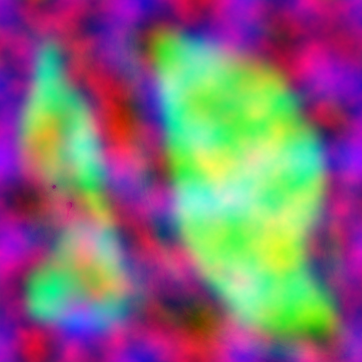

上图：有助于确定云层覆盖范围和类型的纹理。

我们以多种方式修改密度场，如 2017 年的论文所述：
- 云层覆盖：随着覆盖范围的增加，低分辨率云层的重新映射效果会降低，云层会膨胀。
- 云类型：为雨云、积雨云和积云定义了三个基于高度的梯度。 这三者混合并乘法用于侵蚀噪声。
- 风：所有采样点都被基于时间的风所抵消。 风还获得了额外的基于高度的偏移。
- 形状偏差：覆盖范围随着大气中的相对高度而增加，形成“铁砧形状”。风向也略有变化。
- 卷曲噪声：单独的高分辨率云密度场不会产生云中预期的纤细。 我们使用 2D 卷曲噪声纹理抵消该场。

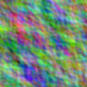

上图是一个32x32的 curl noise， 用于侵蚀云的卷曲噪声

## 3. Cloud Lighting Process

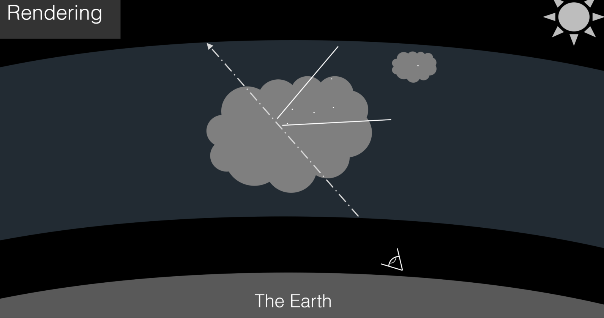

上图：照明样本是朝向太阳的圆锥内的六个点。

我们实施了 2017 年论文中描述的能量衰减方法。 现在能量从 1 开始，并乘以不同的衰减因子趋向于 0。在行进结束时，颜色仅与太阳强度和颜色以及非常不透明的云的一些背景颜色近似。

- 直接照明：将 6 个锥形密度样本朝向太阳，并插入比尔定律的修改版本中。 这是云的颜色和定向照明的最大决定因素。
- Henyey-Greenstein：这个相位函数会使远离太阳的云层变暗。 混合了两种版本以获得对太阳更强的一线希望效果。
- Inscattering：这是低分辨率密度的函数，会在边缘产生变暗效果。 这种效应在高度上减弱，在云层底部增强。 它通过另一个函数创建了 2015 年论文中描述的“糖粉”外观。

对于 raymarch 的每一步，归一化能量都是 alpha 混合的。

`transmittance = mix(transmittance, newSample, (1.0 - accumulatedDensity))`

## 4. Ray Reprojection and Motion Blur

如果没有论文中概述的最重要的优化技术——光线重投影，这些方法将会无法实时运行。

● 每一帧我们都可以使用四分之一分辨率缓冲区来交叉更新最终图像中1 个 4x4 像素块 。
● 为了避免鬼影5，我们保持相机移动时，帧与帧之间的motion vector, 移动/重新投影当前帧中未被光线行进的像素到适当的位置。
● 在我们无法重新投影的地方，比如屏幕的边缘，我们用其中一个低分辨率缓冲区的结果替换。


如上图所示，使用运动向量移动像素通常会在未更新像素的位置创建一个很好的近似值。未更新的像素，指的是当前帧的像素未进行光线行进更新。


1 / 4 分辨率（或 1 / 16 像素）的光线行进对于我们的目标性能是必要的。 重投影处理其余部分。 重投影尝试重用先前帧缓冲区中的信息。 为了决定读取帧缓冲区的哪个位置，我们使用前一帧的相机状态信息计算当前光线指向的位置。 通过一系列快速而廉价的转换，我们可以创建一条射线，找到它击中大气层的位置，找到旧相机空间中的那个点，然后得到旧方向，并从中得到旧纹理坐标。

此功能的性能相关结果在后面的性能部分中有更详细的描述。

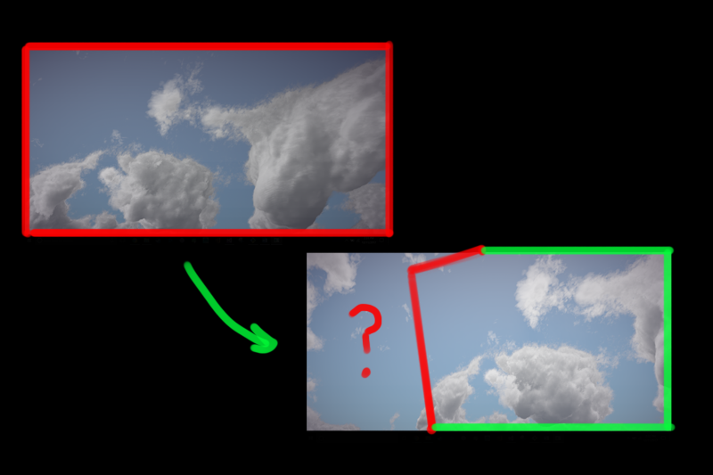

上图：相机向上和向左移动。 带有红色边框的旧图像部分被复制到新的绿色框架中，但左边所缺少一个空白区域则需要重新计算。

当然，这种技术涉及字面上的“边缘”情况 - 当重新投影的光线的 UV 坐标位于前一个帧缓冲区的边界之外时，你会怎么做？ 目前，我们只是将 UV 值限制在 (0, 1)，这会引入某些“条纹”伪像，但是我们可以使用运动模糊使它看起来更自然

 此问题的一个潜在的附加解决方案是“透支”帧，或将图像渲染到大于显示窗口的帧缓冲区，以确保其 UV 超出 0 或 1 的重投影光线实际上对应于正确的 UV 而不是被夹住。 然而，我们还没有实现这一点。


## 5. Day and Night Sky

白天模型是物理 Preetham 模型。 原始实现在致谢名单和源代码中引用。
然而，Preetham 模型并没有考虑夜空。 为此，使用了几种制作（艺术）夜间纹理的方法：https://www.shadertoy.com/view/4llfzj


## 6. Mesh Shadowing

!(error)（随着太阳的移动，云影在“地形”上动画的一些 gif）

为实现这一点，我们只需在网格片段着色器中执行光线投射，这与在云计算着色器中所做的非常相似。 我们将片段的世界空间位置作为一个不变量传递，并使用该点作为光线行进的原点，它朝着太阳的方向行进。 我们从低分辨率云密度图中累积密度不超过几个步骤，并将片段的颜色衰减一减去累积密度以用作阴影。

## 7. Post Process Pipeline

后处理框架由一个包装必要的 Vulkan 资源和统一缓冲区的类组成。 有 3 个片段着色器用于后处理 - 一个“god ray”着色器(as per [this GPU Gem](https://developer.nvidia.com/gpugems/GPUGems3/gpugems3_ch13.html))，一个径向模糊着色器 (adapted from [here](https://forum.unity.com/threads/radial-blur.31970/) and [here](https://stackoverflow.com/questions/4579020/how-do-i-use-a-glsl-shader-to-apply-a-radial-blur-to-an-entire-scene))，以及取自[here](http://filmicworlds.com/blog/filmic-tonemapping-operators/)的神秘海域 2 色tone mapping算法）。 此外，所有渲染都使用每个颜色通道 (RGBA32) 的 32 位进行，因此所有渲染实际上都发生在 HDR 中。 然后提到的色调映射算法将这些值映射到 [0, 1]。 请参阅下面的整个渲染管道。


# Rendering Pipeline


# Differences from Paper <a name = "DifferencesfromPaper"></a>

对于任何考虑在自己的项目中使用这种方法的人：

- 颜色Color。 该论文涉及照明的能量模型，但没有解释获取颜色的方法。 全局光照LUT？ 物理散射测量？ 我们不确定，而是直接使用了 Preetham 天空模型获取天空颜色。
- 在论文中，使用低分辨率深度缓冲区剔除不必要的光线方向。 我们还没有实现，这能很大程度上优化性能。


## Cloud Modeling 改进
---
通常来讲，在实际的项目应用当中，美术会提出至少以下两种体积云的表现需求：
* 一种是划分为对流层和卷云层的高空云海（包含层云，积云，卷积云和卷云等），
* 另一种是为了满足美术需求，有特定形状和体积的体素云。

对于高空云海，我们使用论文中程序噪声云的解决方案，以少量的参数构建细节丰富的分层云海；而对于体素云，我们使用houdini进行体素建模，将模型使用alligator噪音侵蚀转化为VDB数据，然后输出为为3D纹理，这样就能和我们的噪音云进行融合。

如上图是我们美术资源的生成管线，在噪音云和体素云的融合过程中：

* 我们可以制作多张小分辨率的体素云纹理，以锚点定位的方式写入一张大的虚拟3D纹理中。
* 噪音云纹理以拉伸映射的方式载入到虚拟纹理中，实际精度没有变化。

高分辨率的Virtual Texture实际上并不存在于物理内存中，而是由多张小的纹理在逻辑上构成。

**噪声云和体素云不仅可以让美术有更大自由发挥的空间，而且能够兼具程序化生成所具有的随机性和便利性的优点。**

### 噪音云建模


对噪音云建模，我们使用的低频噪声构建云的基本形状。 这是一个4通道128* 128* 128尺寸的3D纹理，R通道存储柏林-沃利噪声，G\B\A对应逐渐提升的3个沃利噪声。
rgba8 4通道 origin size：8mb左右 
DXT5（3：1）压缩后 2.675 MB左右

#### 1. 对流层
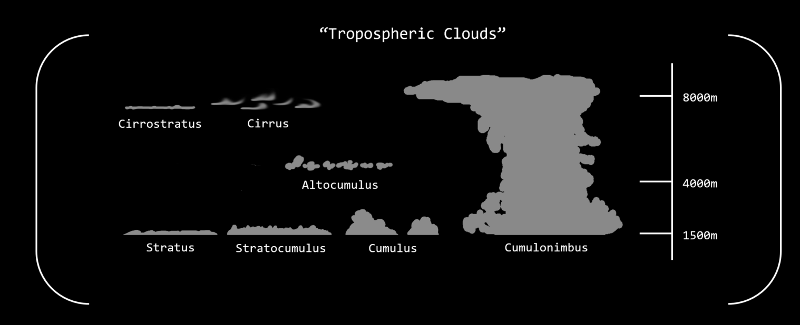
因为我们知道云的类型是由发射速率和温度决定的，而且每种云的高度范围都不一样。我们可以根据云的类型对这些调整进行排序，以表示每种云的高度概率。而实现并支持更多云的类型，具体来讲就是，我们可以通过修改重映射函数的入和出点的值，然后将不同种类的云按照云种类的值按比例混合，从而得到更丰富的云层表现。
**我们改进云建模后，支持新的三种云————层积云，积雨云和高层积云。**
```
// Get the blended density gradient for 3 different cloud types
// relativeHeight is normalized distance from inner to outer atmosphere shell
// cloudType is read from cloud placement blue channel
float cloudLayerDensity(float relativeHeight, float cloudType) {
    relativeHeight = clamp(relativeHeight, 0, 1);

    float altocumulus = max(0.0, remap(relativeHeight, 0.01, 0.3, 0.0, 1.0) * remap(relativeHeight, 0.6, 0.95, 1.0, 0.0))*cloudrenderer.cloudinfo1.z;
    float cumulus = max(0.0, remap(relativeHeight, 0.0, 0.25, 0.0, 1.0) * remap(relativeHeight,  0.3, 0.65, 1.0, 0.0))*cloudrenderer.cloudinfo1.y; 
    float stratus = max(0.0, remap(relativeHeight, 0, 0.1, 0.0, 1.0) * remap(relativeHeight, 0.2, 0.3, 1.0, 0.0))*cloudrenderer.cloudinfo1.x; 

    float stratocumulus = mix(stratus, cumulus, clamp(cloudType * 2.0, 0.0, 1.0));
    float cumulonimbus = mix(cumulus, altocumulus, clamp((cloudType - 0.5) * 2.0, 0.0, 1.0));
    return mix(stratocumulus, cumulonimbus, cloudType);
    
}
```
下图是我们使用matlab建模得到的密度-高度梯度场，能够更直观地体现出 随着高度和cloudtype值的不同，云层密度的变化。
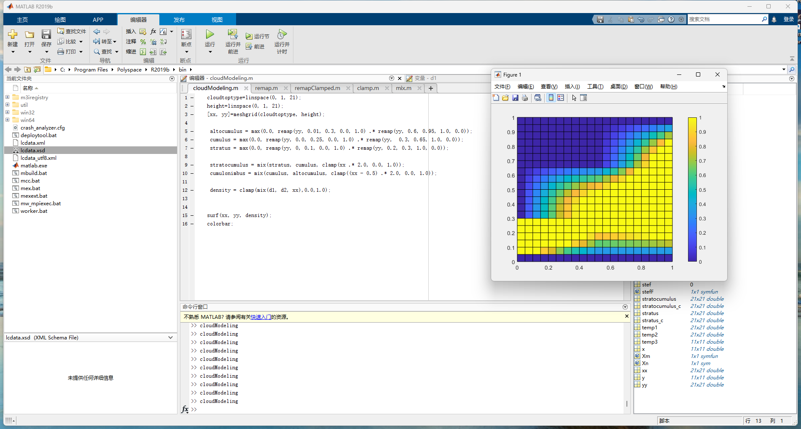

#### 2. 卷云层

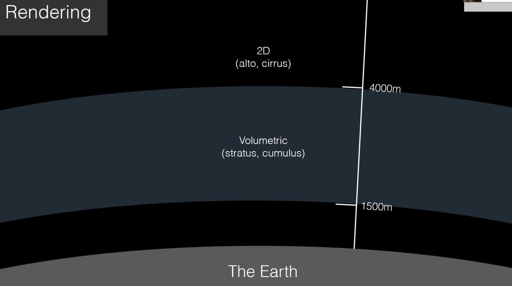
原论文将球形大气中将云分为两种类型。
● 1500 至 4000 米之间的低空体积层级云……
● 以及4000米以上的高海拔的二维高空云和卷云。 
高层云和卷云层仅仅作为2D贴图纹理平铺于天空当中，以滚动纹理表示其运动。其表现效果和可自定义内容非常有限，并没有很好地融入光线步进的体积云体系当中。

然而，为了将高层云与我们的体积云集成，我们将在ray march结束时进行采样,因为采样次数只有一次，且对于带有三个通道的512^2的卷云层2d纹理而言，这个纹理读取的成本可以忽略不计。 

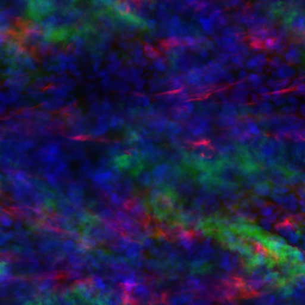

我们编译了一个包含 3 个平铺云景的纹理，涵盖了从细细的卷层云到波涛汹涌的卷积云以及过渡形态的云类型，然后根据采样的云类型在每种云之间进行混合。 在这种情况下，我们使用合适的低覆盖率值，用以驱动幂函数的指数，该函数以低覆盖率值侵蚀云的形状。


下图表示的是cloudtype=0 时，呈现为细细丝缕状的卷云：


### 体素云建模


体素云制作最为困难的部分就是体素云的建模，为此我们主要使用功能强大的建模软件Houdini，其提供的体积建模节点和SDF计算节点等功能，能够很好地帮助我们进行建模，并将云的密度、SDF信息烘焙在3D纹理上输出。


此外，我们也可以直接将现有模型烘培进3D Texture，为此我们采用的方法是：**分层光栅化**。下图表示了一个分层光栅化算法：把模型从上方正交拍摄，将每层扫描便利，把当前层以上的像素全部discard掉，这时模型就会被抠出来一个洞（右红色部分），在洞里可以窥视到模型的背面，而这个洞的形状正正就是当前层光栅化之后的样子。为了算出这个洞的形状（红色没有被绿色挡掉的部分），我们把模型正面画-1，背面画1，Blend Add之后就可以得到以1表示出来的形状。具体算法可以参考[这篇论文](https://prideout.net/blog/distance_fields/)
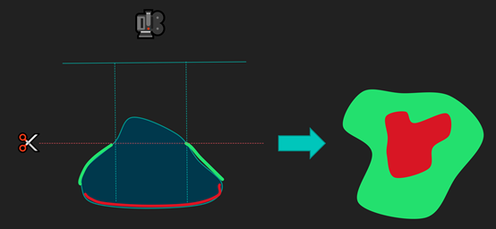

此外，为了美术的快速迭代，我们最好能利用一下GPU里自带的光栅器而不是在CPU里慢慢算。同时，这个方法的缺点是，我们必须确保模型的水密性，不然就会漏色。

最后，我们噪音云输出的3D纹理 是一个4通道128 * 128 * 64尺寸的3D纹理，R通道存储柏林-沃利噪声，G\B\A对应逐渐提升的3个沃利噪声。另一张为单通道128 * 128 * 64尺寸r16的3D纹理，专门用于存储频繁读取的SDF信息。
体素云纹理由云层密度和两个递增的Alligator噪声组成，alligator噪声相比细密的perlin-worly噪声，能够更好地塑造体素云的形状。


### 体积云的流动效果
体积云的流动主要包括三种：一种是全局的流动效果，一种是局部的流动效果，另一种是积雨云的渐变的效果。对于天空上的体积云来说，一般只需要全局的流动效果，局部的流动效果和积雨云渐变可以在云海、风暴云等情况下使用。

**全局流动效果**

我们给美术两个全局风速用于控制体积云的整体流动，一个用于控制云整体形状的流动（包括CloudMap和形状噪声纹理），另一个用于控制云细节（用于侵蚀的高频噪声纹理）的流动。实现上基本就是随时间变化对噪声图的采样坐标进行偏移，非常简单。

值得一提的是，两个风速的Y分量可以控制噪声竖直方向的滚动，将形状噪声纹理沿Y轴滚动可以实现云整体分布随时间的变化，这也是使用3D纹理的好处之一。

此外，我们还根据云的高度给予风向和强度一个偏差值，来体现随高度上升风力逐渐变大的现象。

```
//all sample points are offset by a time-based wind and add an additional height-based offset
windOffset = cloudrenderer.wind_strength * (sky.wind.xyz   + lsHeight * vec3(0.1, 0.05, 0)) * (timeOffset + lsHeight * 200.0)*(cloudrenderer.cloudinfo1.w);
```
此外，我们让不同云层在不同的风向下运动，下图模拟不同云层中的不同风向，以体现对流层和卷云层之间的差异性。
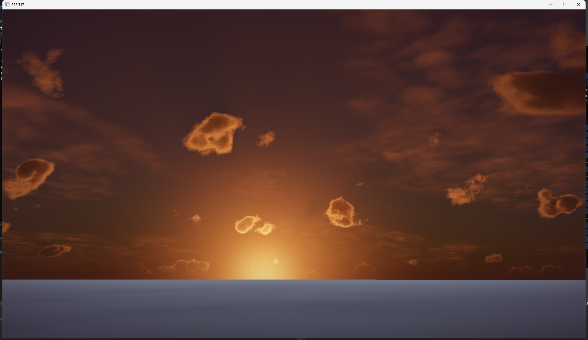

**局部流动效果**

局部流动效果一般使用FlowMap来做，顾名思义，FlowMap是一张记录了流动方向的纹理，我们使用世界坐标的XZ分量计算UV坐标，从FlowMap中采样得到三维的流动方向对噪声纹理进行偏移。对于比较简单的局部流动效果，比如圆形的漩涡，流动方向也可以直接在shader中计算得到，这样可以省去采样FlowMap的开销，但原理都类似。

和全局流动效果不同的是，由于FlowMap中记录的方向可能朝向四面八方，速度也有大有小，随着时间的推移，噪声纹理会被拉伸的越来越严重。解决这一问题的做法是取fract(time)让噪声纹理沿一小段距离重复流动，然后取fract(time+0.5)再采样一遍流动快半拍的噪声纹理，对两次纹理采样结果进行插值，即可得到一个相对平滑的流动效果，实现原理细节可以参考[这篇文章](https://catlikecoding.com/unity/tutorials/flow/texture-distortion/)。

在每个采样点完整的计算两遍CloudDensity显然是一笔很大的开销，因此我们只将FlowMap应用于形状噪声的流动上，即只采样两遍形状噪声纹理，其它纹理贴图保持原来的做法不变。效果如下图：


**积雨云渐变**
通过使用天气贴图中g通道表示的降水信号，我们可以将任何天空都转变为70% 的覆盖率的积雨云。
在下图中，我将降水的值逐渐增加到 100%

降水控制不仅可以调整云层，如果我们增加风速并增加降雨的粒子特效，我们就能实现让暴风云滚滚而来，并渐渐开始向我们下雨的效果。 

## Cloud Lighting 改进
---
### 1. 增加环境光照ambient scattering
在本项目中，我们在原论文光线行进渲染方程的基础上，添加使用物理 Preetham 模型的方法计算所得到的天空环境光照项，其所描述的ambient函数主要与三个参数有关:采样高度、底部颜色和顶部颜色。


=\int_{0}^{D}e^{-\tau\left(x,x^{\prime}\right)}\sigma_{s}\left(x^{\prime}\right)\left[p_{\text{sun}}\left(\boldsymbol{\omega},\boldsymbol{\omega}_{\text{sun}}\right)L_{\text{sun}}\left(x^{\prime},\boldsymbol{\omega}_{\text{sun}}\right)&plus;p_{a&space;m&space;b}L_{a&space;m&space;b}\right]d&space;x^{\prime}{\color{Brown}})

其中 $\sigma_{s} $为消光系数，$p(ω，ω_{sun})$ 为阳光散射的相位函数， $L_{sun}(x,ω_{sun})$为阳光从ωsun方向射入的辐射率。

目前，我们有两种方法来采样大气中的颜色：
1. 我们不使用恒定值，而是通过对几个关键位置的大气采样来计算这些值。这意味着我们的环境条件是动态的，将反映大气的当前状态。其中，我们分别对顶部的大气层和地面反射光采样，根据渲染方程分离化简分别得到底部和顶部的环境颜色。IsotropicLightTop的值来自天空和太阳的贡献，IsotropicLightBottom的值默认设为从地面反射的太阳光的贡献(大约为0.4)，或者可以添加地面可能存在的强烈自发光源（例如火山爆发，夜晚城市的光污染等），这样我们就可以基于物理模拟真实的环境光照变化。代价则是会产生较高的性能开销。

$$ L_{+}(\boldsymbol{x})=\int_{\Omega_{2 \pi+}} p_{i s o} L_{a m b_{+}} e^{-\sigma_{t} \frac{H_{+}}{\boldsymbol{n}_{+} \boldsymbol{\omega}}} d \boldsymbol{\omega} $$

```
// Exponential Integral
// (http://en.wikipedia.org/wiki/Exponential_integral)
float Ei( float z )
{
    return 0.5772156649015328606065 + log( 1e-4 + abs(z) ) + z * (1.0 + z * (0.25 + z * ( (1.0/18.0) + z * ( (1.0/96.0) + z * 
    (1.0/600.0) ) ) ) ); // For x!=0
}

vec3 getAmbientColorPhysical ( float _RelativeHeight, float _ExtinctionCoeff,vec3 _IsotropicLightTop, vec3 _IsotropicLightBottom)
{
     float Ht = 1-_RelativeHeight; // Height to the top of the volume
     float a = -_ExtinctionCoeff * Ht;
     vec3 IsotropicScatteringTop = _IsotropicLightTop * max( 0.0, exp( a ) - a * Ei( a ));
     float Hb = _RelativeHeight; // Height to the bottom of the volume
     a = -_ExtinctionCoeff * Hb;
     vec3 IsotropicScatteringBottom = _IsotropicLightBottom * max( 0.0, exp( a ) - a * Ei( a ));
     return IsotropicScatteringTop + IsotropicScatteringBottom;
}

backgroundCol = getAmbientColorPhysical(rHeight, density);

```
2. 通过数值方式使用固定的天空颜色值，来表示天空上下层不同的颜色渐变，这意味着我们的环境条件是静态的，这将反映美术创作时特定的天空颜色。优点在于它足够廉价，并有更多的艺术创作空间。
```
vec3 getAmbientColorNumerical(in vec3 dir) {
	//color can be converted to uniform buffer for DIY
    vec3 up = mix(vec3(0.3, 0.7, 1.0), vec3(0.15, 0.65, 0.9), dir.y);
    vec3 down = vec3(0.8, 0.9, 1.0);
    float y = dir.y;
    y = smoothstep(0, 1, clamp(remap(y, 0, 0.1, 0, 1), 0, 1));
    return mix(down, up, y);
}
```

显然，通过下图对比我们可以看出，右图（基于物理的环境光）相比左图（基于数值的环境光）表现更加自然生动，更加贴近于天空背景色；左图则是更加偏向于我们设置的颜色，尽管经过一定调试左图也能达到右图的效果，但我们仍需考虑实现所需要的人力成本。项目默认采用第一种方式实现环境光照的采样。

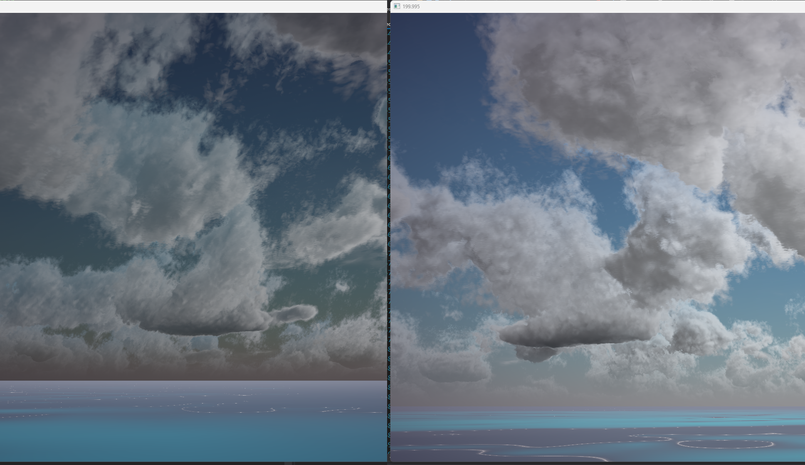


为了性能的考虑，在评估环境照明时我们将忽略环境照明遮挡。考虑到我们的优化目标，实现环境光的自阴影是不现实的，所以我们只考虑采样当前天空中的光照值。因此，环境照明贡献的亮度通常会太亮。为了对抗这种效果，我们让美工能够根据[0,1]中的比例来缩小环境光照的影响。

考虑到天空，即大气散射，如果不使用多重散射解决方案，可能会导致轻微的蓝色云。为了解决这个问题，我们还为美工提供了一种降低环境照明亮度的方法：我们使用[0,1]从云层底部到顶部的线性梯度对环境照明进行加权。我们的方法把天空是对环境照明的主要贡献，并且还考虑了来自地球的反射光。我们使用以下方法来近似:

•采样来自物理 Preetham 模型在顶部和底部分别对环境的光照贡献，Preetham 模型在整合来自太阳亮度时会考虑到一些角度偏差的影响。

•假定环境光照散射的相位方程是各向同性相函数，我们通过pow函数将消光因子和相位方程结合，将其梯度范围偏置到[a, 1]，以此来近似环境照明的a%是由于地面的反弹，并随光线进入云的深处而被吸收。

•最后，我们可以将alpha项减少一个常量，使吸收颜色向叠加的大气颜色倾斜，并用一个[0,1]范围的常量来控制颜色混合的力度。

```
if(sun.direction.y >= 0.0) {
      ambientColor = getAmbientColorPhysical(rHeight,densityAlongLight,backgroundCol,backgroundCol*0.4);
} else {
      ambientColor = getAmbientColorPhysical(rHeight,densityAlongLight,nightambientColor,nightambientColor*0.4);
}

 float PhaseAmbient = pow(1.0f-density,0.25)*rHeight;//extinction* height_bias
 float AmbientScattering = mix(AmbientScattering,PhaseAmbient*ambientColor,(1.0 - accumDensity));
```


但是，我们必须要澄清的一点是，我们所呈现的环境光照控制并非基于精确的物理，而是让我们能够达到预期视觉效果的hack。

下图从左到右分别是不加环境光，固定数值环境光，以及物理模拟环境光的结果。


### 2. cloud volumetric shadow 

在评估环境照明时，为了性能的考虑，我们忽略了环境照明遮挡，因为其最终的表现效果也是几乎没有差别的。但是对太阳光来说，实现云间定向散射的阴影是非常重要的，这很大程度上丰富了云的光影细节。

尽管由于体积云的程序性质，使用了复杂的噪声形状和侵蚀过程，预整合遮挡阴影的做法会很棘手，但添加对云阴影遮挡的支持是可行的，目前各大主流引擎对体积云自阴影的做法有以下两种：

第一种方法是次级光线步进，做法是每个采样点向光源方向再做一次RayMarching来计算transmittance，PC/主机端一般使用6步左右的光线行进，来达到效率和质量的平衡。这种做法思路简单，在采样步数够多的情况下效果也较好，但显然开销会比较大。而本项目中，使用cone tracing算法采样光照并使用6步次级光线行进，同样得了不错的画面表现效果。

第二种方法是体积阴影映射，例如深度阴影，不透明阴影，以及UE4所使用的Beer's Shadow Map。此外，更复杂一点的Transmittance Fucntion Mapping方法被提出有着更好的效果（目前只看到最终幻想中用过类似方法）。Transmittance Fucntion Mapping方法的原理是使用一系列正交基函数来近似透射率函数，基函数的选择上有用傅里叶函数、离散余弦变换、DCT函数、Haar小波函数等做法，与Beer's Shadow Map相比，TFM这类方法在一些情况下对透射率曲线的近似会更准确一些，当然开销也更大。此外通过使用级联阴影csm技术，能够解决阴影贴图在相机近处精度不足的问题。

经过各种实践验证，两种方法各有优缺点：
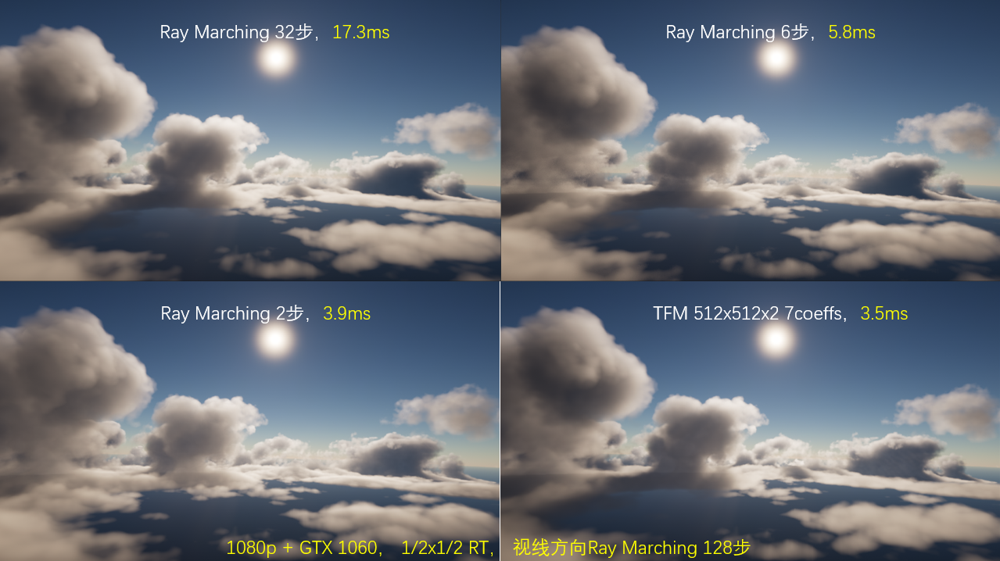

* Ray Marching方法细节更丰富，但开销大（阴影贴图细节少的原因一方面是由于阴影贴图精度受限，而RayMarching没有这个限制；还有一个原因其实是步数不足产生的噪波导致的，不过美术有时候就是喜欢带一些噪波的阴影效果）。
* 体积阴影映射方法效率会更高，且可以用于做云向其它物体的投影，不过在一些情况下会产生较大误差。
* 体积阴影映射的解决方案虽然较为高效，但基于深度的阴影图实际上不太适合体积云渲染，因为如果不执行昂贵的自定义混合，阴影就会变得生硬(考虑到我们已经在一个非常昂贵的光线行进嵌套循环中，这个代价更是难以忽视)。

#### new solution: SDF Shadow
到目前为止，广泛的研究表面SDF除了能加速光线行进渲染的速度以外。SDF对体积渲染中的阴影实现也非常友好，因为阴影可以在没有额外成本的情况下变得柔和。

对于锥形光追，利用SDF能快速地得到近似的阴影夹角,通过三角相似得到遮挡区域和光照扩散的比列，来近似采样点的阴影值


```
//为了添加距离场阴影，还需要在循环之外传入或重新计算世界空间光向量:
float3 LightVector = normalize(sunpos-curpos);
float LightLength = length(sunpos-curpos);
float3 LightVectorWS = normalize( mul( LightVector, Primitive.LocalToWorld));
//然后在光线行进主循环中，在云中光线采样步骤之后:

float3 densityNoise = texture(lowResCloudShape, 0.00002 * vec3(curpos));
CloudInfo cloudinfo;
cloudinfo.density = densityNoise.r;
cloudinfo.sdf = densityNoise.g*LocalObjectBoundsMax; 
float sdftracedist = 1;
float sdfshadow = 1;
float curdist = 0;
float DistanceAlongCone = 0;
float Stepsize = LightLength/DFSteps; // it also could be tweaked to fit the arrangement fo cloud
for (int d = 1; d < DFSteps; d++)
{
 DistanceAlongCone += curdist;
curdist = GetDistanceToNearestSurfaceGlobal(sunPos+LightVectorws*DistanceAlongCone);
//current maxspheresize
// LightTangent could be tweaked to control the range of shadow
float SphereSize = DistanceAlongCone * LightTangent; 
sdfshadow = min( saturate(curdist / SphereSize) , sdfshadow);
}
```
最后将阴影项sdfshadow乘以光线的消光结果，得到有阴影的采样结果。

SDF同样有一些缺点：
* 为了体积渲染而多次查找全局距离字段也较为昂贵的，但相比次级光线追踪是可接受的。
* SDF本身的分辨率受限于建模精度，越高的精度所需要的预烘培时间越长。
* 使用SDF云间阴影会增加额外的渲染成本，但是我们可以牺牲内存占用提升性能，把多个方向的光照信息预烘培进3D纹理，然后根据光照方向进行插值计算。

总的来说，SDF阴影相比次级光线行进有着更高的性能表现，而与阴影贴图相比则是有着更好的纹理细节，是一种兼具两种方法优点的解决方案。

## Cloud Rendering Improvements
---
### Normal RayMarching Optimization
**1. RayMarching提前退出**

由于我们采用的是透射率光照衰减模型，因此当光照衰减的足够多时，我们可以提前退出光线行进循环而不造成过多视觉上的差异损失。
同样，这种思想也适用于云阴影计算时使用的次级光线行进算法
```    
       //光线行进提前退出
        if(accumDensity > 0.99) {
            accumDensity = 1.0;
            break;
        }
      ......

       //次级光线行进提前退出
       //如果沿着视图行进的累积密度超过了一个阈值（我们使用 1.3），则我们将采样切换到低细节模式以进一步优化ray march
       if (lsDensity > 0.0&&densityAlongLight<1.3) {                    
           lsDensity = cloudHiRes(lsPos + windOffset_2, stepSize, lsDensity, lsHeight);               
       }
```
当我们被物体遮挡或者光照衰减足够多时可以直接结束RayMarching，因为后续的计算已经不会为云提供光照了。

**2. Adaptive Raymarching Stepsize**

我们已经使用天空包围盒来直接获取RayMarching的开始与结束位置，但是在包围盒内可能仍然有大量的空白(没有云的地方)，所以在一开始我们使用比较大步进距离进行前进(普通步长)，直到检测到云时回退一步并切换成较小的步进距离(普通步长的0.3倍)，当累计0密度的步长计数到一定次数时(没有碰撞到云)，再切换成较大的步进距离，加速完成RayMarching。
```
        if (density > 0.0) // hit the cloud
        {
            misses = 0;
            if (noHits) {
                //start high-resolution march
                stepSize = 0.05 * atmosphereThickness;
                t -= stepSize;
                stepSize *= 0.3;
                noHits = false;
                continue; // go back half a step
            }
            ......
        } else if (!noHits) {// when the ray get out the cloud right now, count the miss and turn to SDF spheretracing if enabled
            misses++;
            if (misses >= 6) {//10 maybe it is too big
              noHits = true; // revert to low resolution marching
              stepSize = 0.05 * atmosphereThickness;
             }
          
        }    
```

### SDF Raymarching 
有符号距离场（Signed Distance Field）是空间中的一个标量场，值为当前位置离该标量场的0面的距离。SDF的好处有许多，其中一个用途就是可以利用sphere tracing 算法加速raymarching的行进速度。


上图很好地说明了Sphere Tracing是如何运作的。当我在p0的时候，我可以通过SDF记录的安全距离，立刻在下一步就到达p1，4步后就能到达p4，而无须慢吞吞地前后推度。我们原先的做法是用Adaptive Step来快速跳过体积云的Ray Marching的空白区域，比如在空白区域逐渐增加步长，进入云层之后回退并缩短步长。
但这种做法无可避免地会面临一些问题，一个是云中大片空白处， 我们需要按照固定步长规规矩矩地慢速移动；另一个问题则是一般考虑到性能，会将其设置为较大的步长，这样会导致采样率不足导致部分稀薄云的区域会被跳过。而Sphere Tracing则不会有这个问题，它利用SDF中标记出来的安全距离，能到达一个跟采样率和镜头位置都无关的，稳定、精确的隐表面。并且如果从稀薄区域穿出来，它也能快速重启。
**当然SDF的缺点也很明显，就是靠近边缘的时候步进速度会降低，因此在缓慢步进一定距离之后，我们会手动放大步长，并降低采样的质量以提升速度。**

```
    for(float t = atmosphereIsectInner.t; t < atmosphereIsectOuter.t; t += stepSize) 
    {
      ......
        else if(cloudrenderer.cloudinfo4.x == 2&&noHits&&ci.sdf>0)// whe the ray don't hit the cloud, start SDF spheretracing
        {
            if(ci.sdf<600)//when ray has entered or exited the cloud, increase stepsize manually to accelerate sdf sphere tracing
            {
                stepSize = 0.05 * atmosphereThickness;
                stepSize *= 0.3;
            }
            else 
            {
                stepSize = ci.sdf*cloudrenderer.cloudinfo4.y*1000;//cloudrenderer.cloudinfo4.y;//*sdf_scale               
            }
        }
    }
```


### New Three-Phases Raymarching 
由于云建模采用了SDF的稀疏结构，因此云渲染算法也需要做出改变，我将新的渲染算法称之为三段式光线步进。

* 在阶段一，我们处于噪音云渲染范围，此时使用传统的自适应光线步进来渲染噪音云。
* 在阶段二，我们处于体素云区域，此时采用SDF Raymarching来加速光线行进，在2-3步内略过空白区域
* 在阶段三，我们处于云的内部，为了处理云内可能的空洞，此时我们采用短距离自适应步长来处理。
  
而更重要的是在不同阶段切换时对转折点区间转变所需要做出的处理。

* 转折点1，从噪音云所处的阶段1转变到体素云所处的阶段2：
  * 我们需要在靠近SDF区域且视域内包含SDF区域时，根据距离逐渐淡化噪音云密度，防止近距离低精度的噪音云产生视觉错误。
  * 同时，我们对体素云的高频细节噪音进行手动提高频率来使体素云表面更加锐化，来更加凸显体素云的形状。
  * 最后，当我们进入SDF区域时，需要将步进算法切换为SDF Sphere Tracing步进。
* 转折点2，从体素云所处的阶段2转变到体素云内部的阶段3：
  * 在SDF区域快要逼近云的表面时，如果低于步长阈值我们需要手动提高步长
  * 当采样点第一次进入体素云内部时，回退一步进行再采样
  * 当正式进入体素云内部时，切换步进算法为短距离自适应步进算法。
* 转折点3，从体素云内部的阶段3转变到体素云所处的阶段2（云内空洞或云外）：
  * 当采样点离开云进入SDF区域时，
    * 如果采样点没有再次进入体素云内部，切换步进算法为SDF Sphere Tracing步进。
    * 如果采样点再次进入体素云内部时，回退一步进行再采样
    * 如果正式进入体素云内部时，切换步进算法为短距离自适应步进算法。
* 转折点4，从体素云所处的阶段2转变到噪音云所处的阶段1：
  * 当采样点靠近box SDF区域边缘时，手动提高步进步长来来跳过SDF步进边缘停止的现象。
  * 当采样点离开box SDF区域，切换步进算法为长距离自适应步进。


# Performance 

原论文的目标性能约为 2 毫秒，其中大部分时间贡献来自提交的渲染指令数量。并且论文所实现的云解决方案已经在ps4平台（相当于pc平台gtx970显卡），被投入到名为《地平线 零之曙光》的电子游戏的实际应用当中，并取得了出色的画面艺术效果。

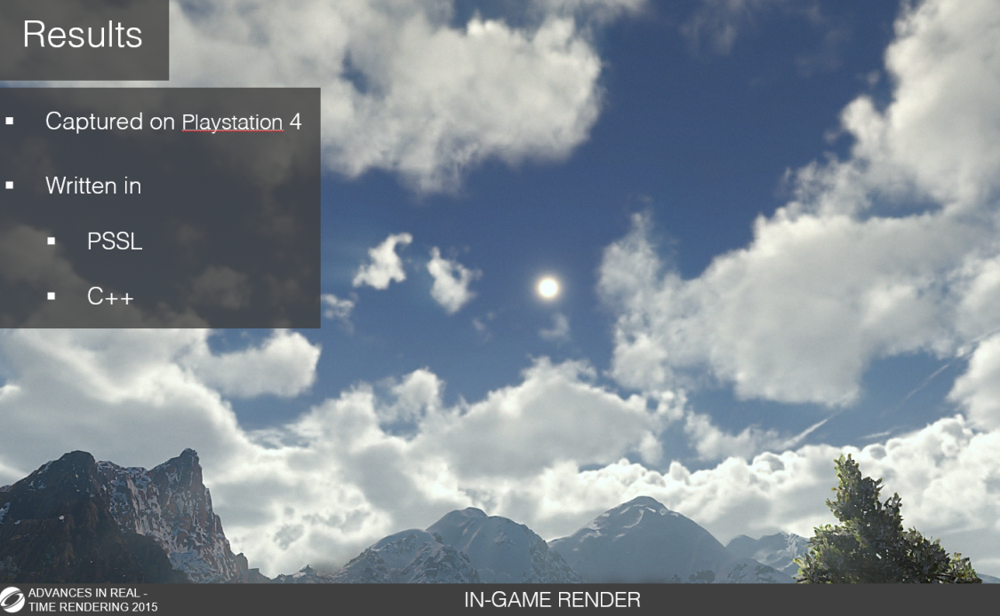

我们遇到的一个瓶颈是在保持低帧缓冲区采样计数的同时实现逼真的godray。 在中低端GPU环境下，我们在godray片段着色器中只取了大约 10 个样本，然后执行径向模糊，这也只需要 10 个样本。 我们仅在大约 40 个样本后才开始注意到真正的 FPS 损失，在更加高性能的GPU环境下，结果远低于此值。

同时，经过上述所提到的改进和提升后，我们使用Renderdoc对渲染管线中Computer Shader的耗时进行测量。

如上图所示，我们使用普通的raymarching渲染和次级光线行进计算云阴影，经过添加额外的卷云层和环境光渲染，我们渲染云的耗时在没有特别优化的情况下提升到了2.7毫秒左右，以此作为baseline我们进行后续对比和消融实验。
## 消融实验
如下图所示，我们使用SDF加速raymarching和次级光线行进，渲染云的消耗被降低到2.1毫秒左右。
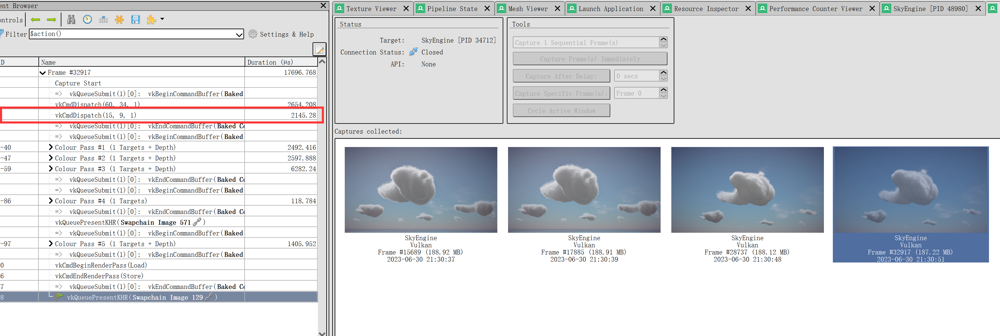
我们使用普通raymarching和SDF软阴影计算，渲染云的消耗被降低到1.6毫秒左右。

（**注意，由于我们使用Houdini将光照信息预烘培进3D纹理，因此云的SDF阴影和次级光线行进表现的阴影并不一致。**）

最后，我们同时使用SDFraymarching和SDF软阴影计算，我们渲染云的消耗被降低到1.6毫秒左右。
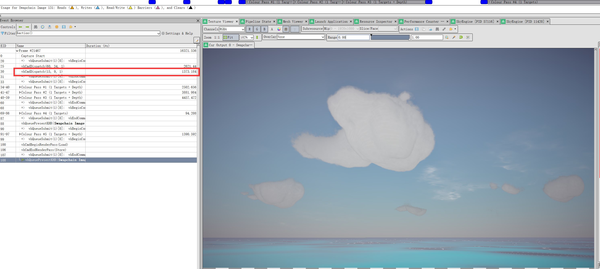


## 对比实验

# Project Planning  <a name = "ProjectPlanning"></a>

## Milestone 1

- 从头开始制作基本的 Vulkan 渲染器框架。
- 3 条工作管道。 屏幕空间背景、图形管道和计算管道。
- 计算管道写入要在后台显示的图像
- 笔记、研究、论文规划。

## Milestone 2

- 过渡到 64 位。
- 重组代码库。 更好的抽象，封装的类。 
- 使用 Tinyobj 加载对象
- 开始在计算管道中实现光线行进算法

## Milestone 3

- 光线行进实现云的密度和灯光堆积
- 管道支持后处理和 HDR
- 太阳和天空是可控的，基于 Preetham 模型

## Milestone 4

- 集成Imgui即时UI界面框架到Vulkan渲染器
- 新增渲染器参数管理类
- 新增渲染器参数UBO到computer shader用于实时调参
- 完善渲染器框架

## Milestone 5
从Modeling，Lighting，Rendering三个层面进行规划

### Modeling
1. 增加对卷云模型的支持
    - [√] 1. 检验并分析cloud render算法 		
	- [√] 2. 检验和假定卷云渲染流程和光照		 
	- [√] 3. 修改卷云贴图，合并三通道纹理					
	- [√] 4. 支持卷云						
	- [√] 5. 修复卷云和层积云重叠显示bug   
2. 增加对体素云的支持 
	- [√] 1. 使用matlab构建高度梯度图
	- [√] 2. 改进云建模的方式，以支持高层卷云和积雨云
	- [√] 3. 使用houdini构建带SDF的3D纹理噪声图
	- [√] 4. 增加对带SDF的3D纹理噪声图的采样函数
3. 支持体积云的流动效果
    - [√] 1. 增加体积云的全局流动效果
    - [×] 2. 支持flowmap局部流动效果方法
    - [√] 3. 增加天气贴图中降雨量对积雨云的权重影响以实现渐变效果


### Lighting
1. 增加环境光照ambient scattering
	- [√] 1. 大气采样计算环境光颜色 		
	- [√] 2. 近似计算大气散射贡献
	- [√] 3. UI面板增加环境散射的控制项	
2. 增加单次散射中对体积云自阴影的支持
	- [√] 1. 支持次级光线步进方法 		
	- [×] 2. 支持TFM体积阴影映射方法
	- [√] 3. 支持SDF阴影方法	
	- [×] 4. 测试SDF阴影方法	


### Rendering
1. 优化普通raymarch算法
	- [√] 1. 增加光线行进提前退出条件判断 		
	- [√] 2. 修改光线行进步长为自适应模式
2. 修改raymarch算法支持SDF
	- [√] 1. 修改云的采样细节 		
	- [√] 2. 增加rendermode的控制UI选项
	- [√] 3. 增加SDF spheretracing 加速渲染

## Milestone 6

temp goal：
~~-[×]1.接入华为云渲染来处理部分Raymarching的计算~~

~~-[×]2.使用SDF优化Raymarching的光照采样~~

~~-[×]3.优化SDF-raymarching算法~~


### Modeling
1. 体素云优化更新
    - [√] 1. 优化体素云的纹理储存结构（包含密度，云类型等信息） 		
	- [√] 2. 选择合适的纹理尺寸大小		
	- [√] 3. 使用额外的纹理存储体素云的SDF信息		 
	- [×] 4. 选择和开发合理的纹理压缩方式存储体素云SDF信息，保证精度的同时以减少运行时内存占用				
    - [√] 5. 支持对体素云的多纹理定点采样
    - [√] 6. 升级使用新型噪音纹理————Curly-Alligator Noise 		 			
		
2. 噪音云与体素云的融合
    - [√] 1. 使用3D纹理R通道存储体素云和噪音云的密度信息 		
	- [√] 2. 使用虚拟纹理构建噪音云和体素云的稀疏结构		 
	- [√] 3. 实现远景和近景云的动态平衡		
### Lighting
1. 环境光分层采样
    - [×] 1. 云层底部太黑，调高最低亮度偏差，光照模型新增双散射和后向散射模拟真实散射状况。 		
    - [√] 1. 优化环境光采样，考虑到高度偏差和地面光源的影响
2. 混合采样优化光照模型  
    - [×] 1. 混合采样，近距离采样局部光照细节，远距离使用SDF阴影和预计算光照 		
    - [×] 2. 预计算使每8帧计算一次分摊成本 	

### Rendering
1. 实现新型三段式光线行进算法
    - [√] 1. 远景：着重渲染噪音云，体现出噪音云自然演变的特征 		
	- [√] 2. 中间态：根据距离体素云SDF距离使用密度插值过渡，逐渐淡化噪音云密度防止低精度云的影响		 
	- [√] 3. 近景：着重渲染体素云，使用体素云的SDF进行短距离步进


# Future Considerations <a name = "Future_Considerations"></a>

## Cloud Animation

我们的项目中，云的运动由三维风矢量和天气系统组成，如果要实现云运动更好的动态效果，可以通过以下步骤实现：
1. 我们可以通过动态计算一个512 × 512的天气图，使用5个八度的动态柏林噪声组成，为每个rgb组件重新映射不同的噪声值。
2. 然后在射线行进期间对该天气图进行采样，以更新当前云样本的覆盖范围、云类型和湿度项。
3. 然后，我们可以在每个光线步骤重新采样这个天气项，并且一个可行的优化将是在光线位置的开始和结束的时候采样天气贴图的数据，并在每个行进步骤插值这些值。
4. 晴天/暴风雨两种天气条件一般是对立出现的，在不考虑太阳雨这种独特现象出现的情况下，我们就可以根据天气图中下雨的概率百分比来判断它们，这使得暴风雨能够自然地出现和消失。

## Light Extinction&Henyey-Greenstein Phase Function

对于较大的颗粒，如污染物、气溶胶、灰尘和水滴，我们必须使用Mie散射。但是，Mie散射理论很难理解，大气各组分的形状和行为的多样性和复杂性通常使相函数很难处理。

例如，云的平均统计相函数如下图所示，我们通常不使用这个复杂的相函数，而是选择一个由多个更简单的函数组成的“heney - greenstein”相函数。

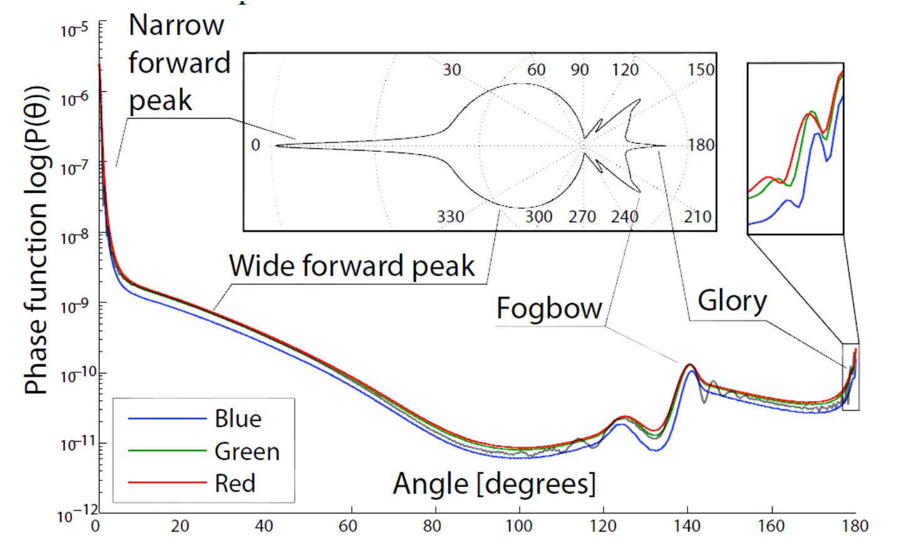

在本项目中，我们通过计算存储单个float的单色透光率来衰减模型光照，但对于一些光照事件，如瑞利散射，由上图可知，实际上是波长相关的。我们出于对性能的追求，并且考虑到三种波长光的相位方程相差不大，本项目只使用单一相位方程作为近似的通解。

但是，如果实际应用中，对云的光影细节有着更高的要求，例如，彩色消光可以模拟消光光谱在液体，日落IBL响应或特定艺术效果下的影响。在这种情况下，我们可以考虑把透光率作为一个float3的值，它将处理天空光照的RGB三色，并与实现更真实的光影细节。这时，我们将不再存储消光率为单个Alpha值，而是需要使用多个渲染目标进行混合，由此可能产生远超原来三倍的性能开销，需要使用者权衡考虑。


## Lighting: Emissive Medium
体积云和粒子等半透明物体的穿插也是一个值得考虑的问题。除了常见的太阳光吸收和散射事件，我们还可以假设介质中存在一些粒子现象，正在发射一些光(雷电，爆炸，火焰等)。如果只把粒子特效与体积云分开处理，我们可以很容易将其添加到射线行进的循环中，计算光照时只需要添加一个发射项到transmittance变量。但是，如果我们想要处理半透明物体与体积云的混合问题，事情就会变得复杂起来。


# Project Defects
1. Preetham 模型所计算的天空背景颜色将太阳光也混合在一起而非独立计算，因此在体积云混合计算时无法对太阳进行独立渲染，导致云中太阳伪影的出现。
2. 项目中光线行进只考虑从地面视角向天空看的情况，并没有考虑航空视角，要实现航空视角需要更多的优化和适配。

# Credits: 
https://vulkan-tutorial.com/Introduction - Base code creation / explanation for the graphics pipeline

https://github.com/SaschaWillems/Vulkan - Additional Vulkan reference code, heavily relied upon for compute pipeline and post-processing

https://github.com/PacktPublishing/Vulkan-Cookbook/ - Even more Vulkan reference that helped with rendering to texture

https://github.com/moneimne and https://github.com/byumjin - Significant help on learning and properly using Vulkan. Check out their stuff!

http://filmicworlds.com/blog/filmic-tonemapping-operators/ - Tonemapping Algorithm

https://github.com/mccannd/Project-Marshmallow - Significant help to build the framework of vulkan cloud renderer 

https://zhuanlan.zhihu.com/p/501039307  A good practice for volumetric cloud in unity

https://zhuanlan.zhihu.com/p/444451024 Great Houdini tool for generetating Cloud SDF 3DTexture

https://zhuanlan.zhihu.com/p/350058989  an idea about SDF-based volumetric cloud on the mobile side

https://github.com/Tw1ddle/Sky-Shader/blob/master/src/shaders/glsl/sky.fragment zz85 on github: implementation of Preetham Sky for Three.js. zz85 credits implementations by Simon Wallner and Martin Upitis. Relevant code is also credited in the shader.

## Libraries:
https://github.com/syoyo/tinyobjloader - OBJ loading in a single header

http://www.glfw.org/ - Vulkan application utilities for Windows

https://github.com/nothings/stb - Image loading in a single header
